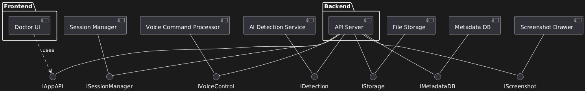

# EndoAssist – AI-Powered Endoscopy Session Assistant

EndoAssist is a standalone desktop application that helps doctors conduct and review endoscopy sessions with enhanced convenience and precision. It provides AI-based polyp detection, voice control features, and a powerful interface for recording, annotating, and browsing medical sessions.

---

## 📦 Features

- 🎬 Record or upload endoscopy session videos
- 🧠 Automatic AI-based polyp detection
- 🖼️ Screenshot drawer for marking key moments
- 🗣️ Voice control (start, stop, take screenshot)
- 🔍 Browse past examinations and review annotations
- 🛠️ Fully offline – runs entirely on the doctor's machine

---

## 🚀 Installation

EndoAssist is distributed as a standalone installer for Windows. To install:

1. Download the latest `.exe` installer from [Releases](./releases).
2. Run the installer and follow the on-screen instructions.
3. Launch the app from the desktop/start menu shortcut.

> 💡 No internet connection is required. All data and models run locally.

---

## 🧱 Architecture

### Static view

The system is composed of several loosely-coupled, highly cohesive components:

- **Frontend (GUI)**: Displays the user interface, handles user actions.
- **Backend**: Coordinates sessions, voice commands, AI detection, and storage.
- **AI Detection Module**: Analyzes videos to detect polyps.
- **Voice Processor**: Interprets commands using Vosk speech-to-text.
- **Screenshot Drawer**: Stores and displays doctor-marked frames.
- **File Storage**: Saves session videos and screenshots locally.
- **Metadata DB**: Stores structured information about sessions and detections.

> Components interact via internal calls, maintaining separation of concerns and enabling easy updates and testing. High cohesion and modularity ensure maintainability.

### Dynamic view

The following sequence diagram represents the process when a doctor uploads an endoscopy video for analysis:

### Deployment view

The application is deployed as a **standalone desktop app** on the doctor’s PC. It includes a graphical user interface (GUI), an embedded backend with AI detection logic, voice command processing (using Vosk), local video/screenshot storage, and a local database managed with SQLAlchemy (typically using SQLite).

- All modules run locally within a single process or bundled executable.
- Data privacy is preserved by avoiding any cloud or network interaction.
- The system is updated via installer, requiring no advanced setup or configuration.

> This deployment choice simplifies usage in clinical environments where network connectivity may be restricted and data confidentiality is critical.

---

## 🛠️ Tech Stack

- **Python FastAPI** for backend
- **Flutter** for GUI
- **SQLAlchemy** + **SQLite** for local metadata storage
- **Vosk** for offline voice recognition
- **OpenCV** for AI-based detection
- **PlantUML** for documentation diagrams

---

## 👥 Authors

- 
-

---

## 📄 License

MIT License. See [LICENSE](./LICENSE) for details.

---

## 📚 Docs

- [Static View (component.puml)](docs/architecture/static-view/component.puml)
- [Dynamic View (upload_and_detect.puml)](docs/architecture/dynamic-view/upload_and_detect.puml)
- [Deployment View (deployment.puml)](docs/architecture/deployment-view/deployment.puml)
