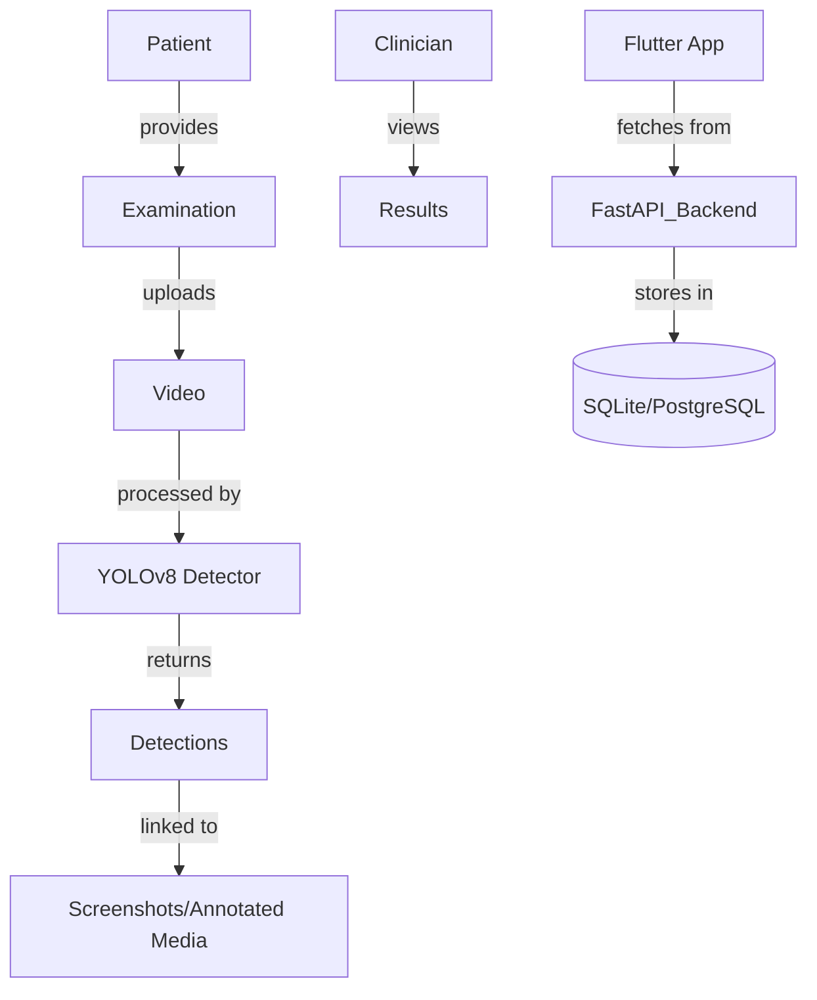

# EndoAssist – AI-Powered Endoscopy Session Assistant

EndoAssist is a standalone desktop application that helps doctors conduct and review endoscopy sessions with enhanced convenience and precision. It provides AI-based polyp detection, voice control features, and a powerful interface for recording, annotating, and browsing medical sessions.

# 📽️ EndoAssist – AI-Powered Endoscopy Session Assistant

## 🧠 Project Goal(s) and Description

EndoAssist is a standalone desktop application that helps doctors conduct and review endoscopy sessions with enhanced convenience and precision. It provides AI-based polyp detection, voice control features, and a powerful interface for recording, annotating, and browsing medical sessions.

### ✨ Key Goals:
- Goal 1: Assist clinicians during endoscopy by providing real-time AI-based polyp detection to enhance diagnostic accuracy.
- Goal 2: Enable hands-free operation using voice control for commands like capturing screenshots or starting/stopping recordings.
- Goal 3: Streamline medical documentation by allowing clinicians to record sessions and automatically annotate findings with AI assistance.
- Goal 4: Simplify review and navigation of past sessions through a searchable interface with thumbnails, timestamps, and diagnostic tags.
- Goal 5: Ensure seamless integration of AI-enhanced workflows into existing clinical practices without disrupting current hardware or routines.

---

## 🧩 Project Context Diagram

**Stakeholders:**
- 👨‍⚕️ Clinicians – use the system during and after endoscopy procedures
- 👨‍💻 Developers – build and maintain the backend, frontend, and AI integration 
- 🧪 Data Scientists – train, evaluate, and monitor AI models like YOLOv8 and voice recognition  
- 🧍 Patients – benefit from improved diagnostic accuracy and documentation
- 🧑‍🏫 Medical Researchers – analyze collected data and use annotated materials for research and publications 

**External Systems:**
- **Local YOLOv8 Model** – AI model for polyp detection in endoscopy videos    
- **SQLite / PostgreSQL** – Database for storing patients, examinations, videos, screenshots and annotations
- **Flutter Desktop App** – Cross-platform user interface for doctors to interact with the system  
- **FastAPI Web Server** – Backend REST API for handling all client requests and system logic
- **Vosk Speech Recognition Engine** – Offline voice recognition for hands-free commands during procedures  
---

## 📅 Feature Roadmap

### ✅ Implemented
- [x] Create and manage patients  
- [x] Create and manage examinations  
- [x] Record and store real-time endoscopy videos  
- [x] Voice control for capturing screenshots during streaming (using Vosk)  
- [x] Polyp detection model analyzing videos (YOLOv8)  
- [x] Drawing tool for annotating screenshots  
- [x] API server interacting with database to store all necessary data  
- [x] Basic Flutter UI for managing patients, examinations, and video streaming  

### 🔜 Planned
- [ ] Record and store doctor's voice during procedures  
- [ ] View full voice recordings and transcripts  
- [ ] Generate short summaries of voice records  
- [ ] Improve and finalize the user interface for the final version  

## 🧭 Usage Instructions / Short User Guide

### 1. Download and Setup

- Open the following link and download all necessary files:  
  [https://disk.yandex.ru/d/xsm4Hyo1oVTSWA/builds](https://disk.yandex.ru/d/xsm4Hyo1oVTSWA/builds)

- Select the folder according to your operating system (macOS or Windows).

- Download and unzip the first archive named `dist.zip`.  
  Open the extracted main folder, then launch the main executable file inside it. Keep this window open while using the application.

- Download and unzip the second archive.

- Run the `endoskopy_tool.exe` file from the second extracted folder to start the main tool.

---

## 📦 Features

- 🎬 Record or upload endoscopy session videos
- 🧠 Automatic AI-based polyp detection
- 🖼️ Screenshot drawer for marking key moments
- 🗣️ Voice control (start, stop, take screenshot)
- 🔍 Browse past examinations and review annotations
- 🛠️ Fully offline – runs entirely on the doctor's machine

---

## 🚀 Usage

1. **Download the Latest Build**  
   Go to the [Actions](https://github.com/your-username/your-repo/actions) tab and download the latest successful build artifact.

2. **Start the API Server**  
   Run the downloaded `.exe` file to start the API server.  
   > ⚠️ **Note:** API access credentials or configuration must be requested separately from the repository maintainers.

3. **Run the Application**  
   After the API server is up and running, launch the main application by executing its corresponding `.exe` file.

> 💡 No internet connection is required. All data and models run locally.

---

## Development

---

### [Kanban board](https://github.com/Kazualov/endoscopy_tool/blob/main/docs/Contributing.md)

### [Git workflow](https://github.com/Kazualov/endoscopy_tool/blob/main/docs/Contributing.md)

### [Secrets management](https://github.com/Kazualov/endoscopy_tool/blob/main/docs/Contributing.md)

---

## [Quality assurance](https://github.com/Kazualov/endoscopy_tool/blob/main/docs/quality_assurance.md)

---

### Build and deployment

### [Continuous Integration](https://github.com/Kazualov/endoscopy_tool/tree/main/docs/automation)

---

### Continuous Deployment

We use a dedicated GitHub Actions workflow to build and package the Flutter Windows app.

#### CD Workflow

- **Workflow Name**: Build Flutter Windows App
- **Triggers**:
  - Automatically on push to the `main` branch
  - Manually via the GitHub Actions UI (`workflow_dispatch`)
- **Build Output**: Windows executable (`.exe`) and related files, uploaded as an artifact

📄 Workflow file:  
👉 [Build Flutter Windows App](https://github.com/Kazualov/endoscopy_tool/blob/main/.github/workflows/windows-build.yml)

#### Build Steps

1. Checkout the code (with Git LFS support)
2. Set up Flutter 3.32.4 on the stable channel
3. Enable Windows desktop support
4. Install dependencies (`flutter pub get`)
5. Build the release version for Windows (`flutter build windows --release`)
6. Upload the compiled app as a GitHub Actions artifact

You can find workflow run history here:  
👉 [GitHub Actions - CD Runs](https://github.com/Kazualov/endoscopy_tool/actions)

---

## 🧱 [Architecture](https://github.com/Kazualov/endoscopy_tool/new/main/docs/architecture)

---

## 🛠️ Tech Stack

- **Python FastAPI** for backend
- **Flutter** for GUI
- **SQLAlchemy** + **SQLite** for local metadata storage
- **Vosk** for offline voice recognition
- **OpenCV** for AI-based detection
- **PlantUML** for documentation diagrams

---

## 📄 License

MIT License. See [LICENSE](./LICENSE) for details.

---

## 📚 Docs

- [Static View (component-diagram.puml)](docs/architecture/static-view/static-diagram.puml)
- [Dynamic View (sequence-diagram.puml)](docs/architecture/dynamic-view/sequence-diagram.puml)
- [Deployment View (deployment-diagram.puml)](docs/architecture/deployment-view/deployment-diagram.puml)
