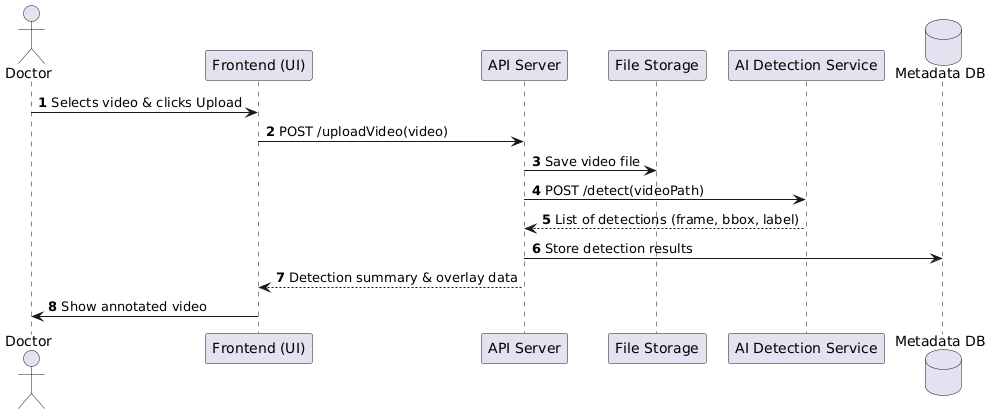
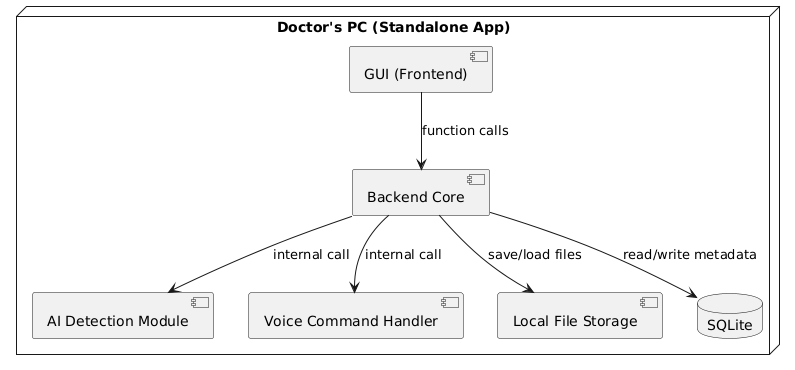

# EndoAssist – AI-Powered Endoscopy Session Assistant

EndoAssist is a standalone desktop application that helps doctors conduct and review endoscopy sessions with enhanced convenience and precision. It provides AI-based polyp detection, voice control features, and a powerful interface for recording, annotating, and browsing medical sessions.

---

## 📦 Features

- 🎬 Record or upload endoscopy session videos
- 🧠 Automatic AI-based polyp detection
- 🖼️ Screenshot drawer for marking key moments
- 🗣️ Voice control (start, stop, take screenshot)
- 🔍 Browse past examinations and review annotations
- 🛠️ Fully offline – runs entirely on the doctor's machine

---

## 🚀 Usage

1. **Download the Latest Build**  
   Go to the [Actions](https://github.com/your-username/your-repo/actions) tab and download the latest successful build artifact.

2. **Start the API Server**  
   Run the downloaded `.exe` file to start the API server.  
   > ⚠️ **Note:** API access credentials or configuration must be requested separately from the repository maintainers.

3. **Run the Application**  
   After the API server is up and running, launch the main application by executing its corresponding `.exe` file.

> 💡 No internet connection is required. All data and models run locally.

---

## Development

### [Kanban board](https://github.com/Kazualov/endoscopy_tool/blob/main/docs/Contributing.md)

---

### [Git workflow](https://github.com/Kazualov/endoscopy_tool/blob/main/docs/Contributing.md)

### [Secrets management](https://github.com/Kazualov/endoscopy_tool/blob/main/docs/Contributing.md)
---

## Quality assurance

### Quality attribute scenarios
See [docs/quality-assurance/quality-attribute-scenarios.md](docs/quality-assurance/quality-attribute-scenarios.md)

### Automated tests

**Tools used:**
- `pytest` — unit and integration testing
- `TestClient` — for simulating API requests and integration testing in Dart backend
- `flutter_test` — for writing and executing unit tests in Flutter
- `flake8` — for checking Python code style
- `bandit` — for Python security linting

**Types of tests:**
- Unit test for Python ([/Unit Tests/Process_Command.py](https://github.com/Kazualov/endoscopy_tool/blob/Tests/Unit%20Tests/Process_Command.py))
- Integration tests ([Integration_Tests](https://github.com/Kazualov/endoscopy_tool/tree/Tests/Integration_Tests))
- Unit tests for Flutter ([test](https://github.com/Kazualov/endoscopy_tool/tree/Tests/test))
- Static analysis tools in CI pipeline ([workflow](https://github.com/Kazualov/endoscopy_tool/actions/runs/16092200891/workflow))

### User acceptance tests
See [docs/quality-assurance/user-acceptance-tests.md](docs/quality-assurance/user-acceptance-tests.md)

---

### Build and deployment

### Continuous Integration

This project uses **GitHub Actions** for Continuous Integration (CI). The CI workflows are triggered on every push and pull request.

#### CI Workflow

The CI pipeline consists of the following jobs:

- **Lint Python** (`lint-python`)
- **Lint Flutter** (`lint-flutter`)
- **Build Flutter App for Windows** (`build-flutter`)
- **Python Tests with coverage** (`test-python`)
- **Flutter Tests with coverage** (`test-flutter`)
- **Security Check with Safety** (`security-check`)

The full CI workflow file can be found here:  
👉 [`CI`](https://github.com/Kazualov/endoscopy_tool/actions/runs/16092200891)

#### Static Analysis Tools

| Tool             | Language | Purpose                                                              |
|------------------|----------|----------------------------------------------------------------------|
| `flake8`         | Python   | Static analysis for Python code to enforce PEP8 style and catch bugs. |
| `flutter analyze`| Dart     | Analyzes Dart code for potential errors and style violations.        |

#### Testing Tools

| Tool              | Language | Purpose                                                             |
|-------------------|----------|---------------------------------------------------------------------|
| `pytest`          | Python   | Runs unit and integration tests.                                   |
| `pytest-cov`      | Python   | Collects and reports Python test coverage.                         |
| `flutter test`    | Dart     | Runs Flutter unit and widget tests.                                |
| `lcov` + `genhtml`| Dart     | Generates HTML coverage reports for Flutter test results.          |

#### Security Tools

| Tool    | Language | Purpose                                              |
|---------|----------|------------------------------------------------------|
| `safety`| Python   | Checks for known security vulnerabilities in dependencies. |

#### CI Workflow

The full CI workflow file can be found here:  
👉 [CI](https://github.com/Kazualov/endoscopy_tool/blob/Tests/.github/workflows/ci.yml)

#### CI Workflow Runs

You can view the status and history of all CI runs here:  
👉 [GitHub Actions - Workflow Runs](https://github.com/Kazualov/endoscopy_tool/actions)

---

### Continuous Deployment

We use a dedicated GitHub Actions workflow to build and package the Flutter Windows app.

#### CD Workflow

- **Workflow Name**: Build Flutter Windows App
- **Triggers**:
  - Automatically on push to the `main` branch
  - Manually via the GitHub Actions UI (`workflow_dispatch`)
- **Build Output**: Windows executable (`.exe`) and related files, uploaded as an artifact

📄 Workflow file:  
👉 [Build Flutter Windows App](https://github.com/Kazualov/endoscopy_tool/blob/main/.github/workflows/windows-build.yml)

#### Build Steps

1. Checkout the code (with Git LFS support)
2. Set up Flutter 3.32.4 on the stable channel
3. Enable Windows desktop support
4. Install dependencies (`flutter pub get`)
5. Build the release version for Windows (`flutter build windows --release`)
6. Upload the compiled app as a GitHub Actions artifact

You can find workflow run history here:  
👉 [GitHub Actions - CD Runs](https://github.com/Kazualov/endoscopy_tool/actions)

---

## 🧱 Architecture

### Static view

The system is composed of several loosely-coupled, highly cohesive components:

- **Frontend (GUI)**: Displays the user interface, handles user actions.
- **Backend**: Coordinates sessions, voice commands, AI detection, and storage.
- **AI Detection Module**: Analyzes videos to detect polyps.
- **Voice Processor**: Interprets commands using Vosk speech-to-text.
- **Screenshot Drawer**: Stores and displays doctor-marked frames.
- **File Storage**: Saves session videos and screenshots locally.
- **Metadata DB**: Stores structured information about sessions and detections.

> Components interact via internal calls, maintaining separation of concerns and enabling easy updates and testing. High cohesion and modularity ensure maintainability.

### Dynamic view

The following sequence diagram represents the process when a doctor uploads an endoscopy video for analysis:

### Deployment view

The application is deployed as a **standalone desktop app** on the doctor’s PC. It includes a graphical user interface (GUI), an embedded backend with AI detection logic, voice command processing (using Vosk), local video/screenshot storage, and a local database managed with SQLAlchemy (typically using SQLite).

- All modules run locally within a single process or bundled executable.
- Data privacy is preserved by avoiding any cloud or network interaction.
- The system is updated via installer, requiring no advanced setup or configuration.

> This deployment choice simplifies usage in clinical environments where network connectivity may be restricted and data confidentiality is critical.

---

## 🛠️ Tech Stack

- **Python FastAPI** for backend
- **Flutter** for GUI
- **SQLAlchemy** + **SQLite** for local metadata storage
- **Vosk** for offline voice recognition
- **OpenCV** for AI-based detection
- **PlantUML** for documentation diagrams

---

## 📄 License

MIT License. See [LICENSE](./LICENSE) for details.

---

## 📚 Docs

- [Static View (component-diagram.puml)](docs/architecture/static-view/static-diagram.puml)
- [Dynamic View (sequence-diagram.puml)](docs/architecture/dynamic-view/sequence-diagram.puml)
- [Deployment View (deployment-diagram.puml)](docs/architecture/deployment-view/deployment-diagram.puml)
