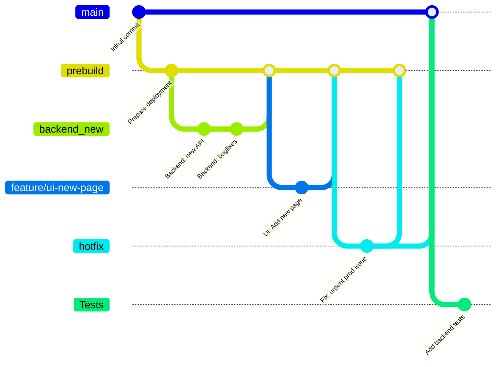

# EndoAssist – AI-Powered Endoscopy Session Assistant

EndoAssist is a standalone desktop application that helps doctors conduct and review endoscopy sessions with enhanced convenience and precision. It provides AI-based polyp detection, voice control features, and a powerful interface for recording, annotating, and browsing medical sessions.

---

## 📦 Features

- 🎬 Record or upload endoscopy session videos
- 🧠 Automatic AI-based polyp detection
- 🖼️ Screenshot drawer for marking key moments
- 🗣️ Voice control (start, stop, take screenshot)
- 🔍 Browse past examinations and review annotations
- 🛠️ Fully offline – runs entirely on the doctor's machine

---

## 🚀 Installation

EndoAssist is distributed as a standalone installer for Windows. To install:

1. Download the latest `.exe` installer from [Releases](./releases).
2. Run the installer and follow the on-screen instructions.
3. Launch the app from the desktop/start menu shortcut.

> 💡 No internet connection is required. All data and models run locally.

---

## Development

### Kanban board

Our team uses a Kanban board to manage tasks during the development process. You can view the board here:  
[🔗 Kanban Board Link](https://github.com/users/kite121/projects/1)

**Columns and Entry Criteria:**

- **To Do**  
  _Entry criteria_: The task was accepted by the team and has a description and a goal. The task also has a priority and a Story Points rating.

- **In Progress**  
  _Entry criteria_: The task is being completed in the current sprint. The task is assigned to a specific person and has Acceptance criteria for accepting the work.

- **Done**  
  _Entry criteria_: All acceptance criteria have been met. The task was accepted by the team and the customer.

---

### Git workflow

We adapted the **GitHub Flow** model with additional structure for code quality and collaboration.

#### 📌 Issue Management

- Issues are created with a detailed and accurate description of the task, including the necessary requirements.
- Each issue should be labeled depending on its type (UI, backend, ML, bug, optional).
- Each question must be evaluated together with the poker team, and then labeled 'estimated: x' (where x is the number of Story Points assigned during the poker game)
- The assignment is made only after the team discusses it during scrum planning, where the issues that have already been raised will be assigned during the sprint.
- Issues are created using [Issue Templates](https://github.com/Kazualov/endoscopy_tool/tree/485387f3265be78259112ad46ae5883865a9260e/.github/ISSUE_TEMPLATE) defined in the repository.

#### 🌿 Branching Strategy

Our project follows a **custom Gitflow-inspired workflow**, designed to maintain code stability, separate concerns, and streamline deployment.

##### 🌳 Main Branches
- **`main`**  
  Contains only **stable, production-ready** code.  
  Merges occur only after thorough testing and successful deployment.

- **`prebuild`**  
  Serves as a **staging area** for deployment.  
  Code from development branches is merged here for integration testing before going to `main`.

##### 🛠 Development Branches

- **`backend_new`**  
  All new backend features are developed here.  
  Once complete, changes are merged into `prebuild`.

- **`prebuild`**  
  Integration branch for UI development.  
  Frontend developers create separate branches from `prebuild` and merge them back upon feature completion.

- **`Tests`**  
  Contains all **automated tests** and related infrastructure.  
  Updated in parallel with feature development.

##### 🔥 Hotfixes

- **`hotfix/*`**  
  Used for **critical bug fixes** in production.  
  These branches are created from `main`, then merged back into both `main` and `prebuild`.

---

This strategy allows for:
- ✅ Isolated and parallel development of backend and UI
- 🚀 Smooth deployment pipeline from development to production
- 🧯 Quick integration of emergency fixes

#### ✅ Commits

- Custom structure is used for comets. It is necessary to specify the main changes written in English, and it would be good to specify the issue that was resolved or relates to it.

#### 🔀 Pull Requests

- Backend features are developed in the `backend_new` branch and merged into `prebuild` via PRs.
- UI and other feature branches (e.g., `feature/*`) are branched from and merged into `prebuild`.
- Bugfix branches (`bugfix/*`) are also merged into `prebuild`.
- Hotfix branches (`hotfix/*`) are created from `main` and merged back into both `main` and `prebuild`.
- All PRs (except hotfixes) target the `prebuild` branch.
- Hotfix PRs target the `main` branch directly.
- Each PR must use the [Pull Request Template](https://github.com/Kazualov/endoscopy_tool/blob/485387f3265be78259112ad46ae5883865a9260e/.github/pull-request-template.md) and link relevant issues with keywords like `Closes #issue_number`.

#### 🧪 Code Reviews

- At least one team member must review the code before big merging.
- Reviewers check for correctness, readability, test coverage, and adherence to style guidelines.

#### 🚀 Merging PRs

- Big PRs are merged only after all reviews and CI checks pass.
-If the merge is not large and the team member is completely confident that everything is fine, then a review is not necessary

#### 🧹 Resolving Issues

- Issues are closed automatically by referencing them in the merged PRs (e.g., `Closes #12`).

---

### 📈 Git Workflow Diagram

---

## Quality assurance

### Quality attribute scenarios
See [docs/quality-assurance/quality-attribute-scenarios.md](docs/quality-assurance/quality-attribute-scenarios.md)

### Automated tests

**Tools used:**
- `pytest` — unit testing
- `newman` — integration tests via Postman
- `flake8` — code style
- `bandit` — security linting

**Types of tests:**
- Unit tests (`/tests/unit`)
- Integration tests (`/tests/integration`)
- Static analysis tools in CI pipeline

Tests are triggered on each pull request via GitHub Actions. Failed tests block merging.

---

### Secrets management
- We do not have any data that requires encryption, so no methods have been used to encrypt or protect the data.

## 🧱 Architecture

### Static view

The system is composed of several loosely-coupled, highly cohesive components:

- **Frontend (GUI)**: Displays the user interface, handles user actions.
- **Backend**: Coordinates sessions, voice commands, AI detection, and storage.
- **AI Detection Module**: Analyzes videos to detect polyps.
- **Voice Processor**: Interprets commands using Vosk speech-to-text.
- **Screenshot Drawer**: Stores and displays doctor-marked frames.
- **File Storage**: Saves session videos and screenshots locally.
- **Metadata DB**: Stores structured information about sessions and detections.

> Components interact via internal calls, maintaining separation of concerns and enabling easy updates and testing. High cohesion and modularity ensure maintainability.

### Dynamic view

The following sequence diagram represents the process when a doctor uploads an endoscopy video for analysis:

### Deployment view

The application is deployed as a **standalone desktop app** on the doctor’s PC. It includes a graphical user interface (GUI), an embedded backend with AI detection logic, voice command processing (using Vosk), local video/screenshot storage, and a local database managed with SQLAlchemy (typically using SQLite).

- All modules run locally within a single process or bundled executable.
- Data privacy is preserved by avoiding any cloud or network interaction.
- The system is updated via installer, requiring no advanced setup or configuration.

> This deployment choice simplifies usage in clinical environments where network connectivity may be restricted and data confidentiality is critical.

---

## 🛠️ Tech Stack

- **Python FastAPI** for backend
- **Flutter** for GUI
- **SQLAlchemy** + **SQLite** for local metadata storage
- **Vosk** for offline voice recognition
- **OpenCV** for AI-based detection
- **PlantUML** for documentation diagrams

---

## 👥 Authors

- 
-

---

## 📄 License

MIT License. See [LICENSE](./LICENSE) for details.

---

## 📚 Docs

- [Static View (component-diagram.puml)](docs/architecture/static-view/static-diagram.puml)
- [Dynamic View (sequence-diagram.puml)](docs/architecture/dynamic-view/sequence-diagram.puml)
- [Deployment View (deployment-diagram.puml)](docs/architecture/deployment-view/deployment-diagram.puml)
