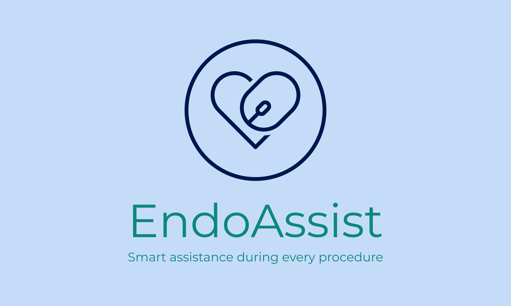

<h1 align="left">About the project</h1>

  

<h1 align="left">EndoAssist</h1>

<h3 align="left">
  AI-powered local endoscopy software with anomaly detection and voice control.
  Deployed MVP v2.5 - https://disk.yandex.ru/client/disk/SWD_endoscopy_tool/MVP2.5/builds
  Demo video - https://disk.yandex.ru/d/9Cqbwf-02HCGew/demo
</h3>

## 🧠 Project Goal(s) and Description

EndoAssist is a standalone desktop application that helps doctors conduct and review endoscopy sessions with enhanced convenience and precision. It provides AI-based polyp detection, voice control features, and a powerful interface for recording, annotating, and browsing medical sessions.

### ✨ Key Goals:
- Goal 1: Assist clinicians during endoscopy by providing real-time AI-based polyp detection to enhance diagnostic accuracy.
- Goal 2: Enable hands-free operation using voice control for commands like capturing screenshots or starting/stopping recordings.
- Goal 3: Streamline medical documentation by allowing clinicians to record sessions and automatically annotate findings with AI assistance.
- Goal 4: Simplify review and navigation of past sessions through a searchable interface with thumbnails, timestamps, and diagnostic tags.
- Goal 5: Ensure seamless integration of AI-enhanced workflows into existing clinical practices without disrupting current hardware or routines.

---

## 🧩 Project Context Diagram

**Stakeholders:**
- 👨‍⚕️ Clinicians – use the system during and after endoscopy procedures
- 👨‍💻 Developers – build and maintain the backend, frontend, and AI integration 
- 🧪 Data Scientists – train, evaluate, and monitor AI models like YOLOv8 and voice recognition  
- 🧍 Patients – benefit from improved diagnostic accuracy and documentation
- 🧑‍🏫 Medical Researchers – analyze collected data and use annotated materials for research and publications 

**External Systems:**
- **Local YOLOv8 Model** – AI model for polyp detection in endoscopy videos    
- **SQLite / PostgreSQL** – Database for storing patients, examinations, videos, screenshots and annotations
- **Flutter Desktop App** – Cross-platform user interface for doctors to interact with the system  
- **FastAPI Web Server** – Backend REST API for handling all client requests and system logic
- **Vosk Speech Recognition Engine** – Offline voice recognition for hands-free commands during procedures  
---

## 📅 Feature Roadmap

### ✅ Implemented
- [x] Create and manage patients  
- [x] Create and manage examinations  
- [x] Record and store real-time endoscopy videos  
- [x] Voice control for capturing screenshots during streaming (using Vosk)  
- [x] Polyp detection model analyzing videos (YOLOv8)  
- [x] Drawing tool for annotating screenshots  
- [x] API server interacting with database to store all necessary data  
- [x] Basic Flutter UI for managing patients, examinations, and video streaming  

### 🔜 Planned
- [ ] Record and store doctor's voice during procedures  
- [ ] View full voice recordings and transcripts  
- [ ] Generate short summaries of voice records  
- [ ] Improve and finalize the user interface for the final version
---

## 🔧 Installation and Deployment Instructions

1. **Download the Necessary Files**  
   Open the following link in your browser:  
   [https://disk.yandex.ru/d/xsm4Hyo1oVTSWA/builds](https://disk.yandex.ru/d/xsm4Hyo1oVTSWA/builds)

2. **Choose Your Operating System Folder**  
   Select either the **macOS** or **Windows** folder, depending on your system.

3. **Set Up the Background Service**  
   - Download and unzip the first archive named `dist.zip`.
   - Open the extracted main folder.
   - Launch the main executable file inside this folder.
   - **Important:** Keep this window open while using the application.

4. **Run the Main Tool**  
   - Download and unzip the second archive (located in the same OS-specific folder).
   - Open the extracted folder.
   - Run the executable named `endoskopy_tool.exe` to start the main application.

---
## 📘 Usage Instructions / Short User Guide

This guide walks you through how to use the application for creating examinations, recording or uploading procedures, capturing and annotating screenshots, and viewing AI-based detections.

### 🏥 1. Creating a New Examination

- Open the application and click the ➕ **Plus** button on the main screen.
- Fill in the required **patient information** in the form.
- Once the examination is created, you will be taken to the **live camera screen**.

### 🎥 2. Live Recording and Real-Time AI Detection

- On the live camera screen:
  - Click the **Record** button to start recording the procedure.
  - Click again to **stop recording**.
- To enable AI support, toggle the **"AI On"** switch — this activates **real-time detection of polyps** while recording.
- You can capture screenshots in two ways:
  - 🔊 Say **"Screenshot"** (voice command).
  - 🖱️ Click the **Screenshot** button on the right-hand side.
- After taking a screenshot, you can click **Draw** to open the annotation tools with various drawing options and tooltips.

### 📂 3. Uploading a Video Instead of Live Recording

- Alternatively, on the same live camera screen, you can choose to **upload a pre-recorded video**.
- After uploading, the system will automatically process the video and apply AI-based **polyp detection**.
- You will then be redirected to the **video player screen**, where:
  - The video will display with detected anomalies highlighted.
  - You can take screenshots using the **button only** (voice commands are disabled for uploaded videos).
  - Screenshots can also be annotated using the drawing tools.

### 🧭 4. Reviewing and Navigating Results

- After completing a real-time recording or uploading a video:
  - You are automatically taken to a **review screen**.
  - Here, you can:
    - Watch the recorded or uploaded video.
    - View AI detection results.
    - Browse through and annotate captured screenshots.

### 📁 5. Accessing Saved Examinations

- All completed examinations — whether live or uploaded — are stored on the **main screen**.
- From here, you can reopen any examination to:
  - Rewatch videos,
  - View and edit annotations,
  - Review AI results,
  - Or export screenshots and data (if supported).

## 🛠️ Development

---

### 📌 [Kanban board](https://github.com/Kazualov/endoscopy_tool/blob/main/docs/Contributing.md)

### 🌳 [Git workflow](https://github.com/Kazualov/endoscopy_tool/blob/main/docs/Contributing.md)

### 🔑 [Secrets management](https://github.com/Kazualov/endoscopy_tool/blob/main/docs/Contributing.md)

---

## ✅ [Quality assurance](https://github.com/Kazualov/endoscopy_tool/blob/main/docs/quality_assurance.md)

---

## 🚀 Build and deployment

---

### 🔄 [Continuous Integration](https://github.com/Kazualov/endoscopy_tool/tree/main/docs/automation/continuous-integration.md)

### 📦 [Continuous Deployment](https://github.com/Kazualov/endoscopy_tool/blob/main/docs/automation/continuous-delivery.md)

---

## 🧱 Architecture

---

### 🌐 [Deployment View](https://github.com/Kazualov/endoscopy_tool/blob/main/docs/architecture/deployment-view/deployment-diagram.png)

### 🔁 [Dynamic View](https://github.com/Kazualov/endoscopy_tool/blob/main/docs/architecture/dynamic-view/sequence-diagram.png)

### 🧩 [Static View](https://github.com/Kazualov/endoscopy_tool/blob/main/docs/architecture/static-view/component-diagram.png)

### 📄 [Deployment View (deployment-diagram.puml)](docs/architecture/deployment-view/deployment-diagram.puml)  
### 📄 [Dynamic View (sequence-diagram.puml)](docs/architecture/dynamic-view/sequence-diagram.puml)  
### 📄 [Static View (component-diagram.puml)](docs/architecture/static-view/static-diagram.puml)

---

## 🛠️ Tech Stack

- **Python FastAPI** for backend
- **Flutter** for GUI
- **SQLAlchemy** + **SQLite** for local metadata storage
- **Vosk** for offline voice recognition
- **OpenCV** for AI-based detection
- **PlantUML** for documentation diagrams

---

## 📄 License

MIT License. See [LICENSE](./LICENSE) for details.

