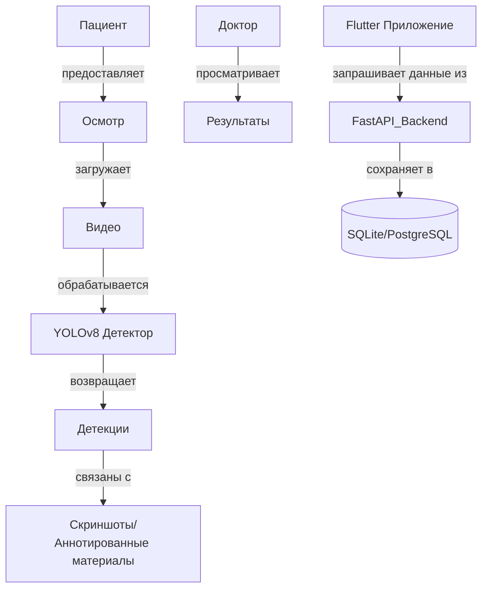

<h1 align="left">О проекте</h1>

  

<h1 align="left">EndoAssist</h1>

<h3 align="left">
  Локальное эндоскопическое ПО с ИИ для обнаружения аномалий и голосовым управлением.
</h3>

---

## 🚀 Деплой и демонстрация (для заказчика)

> Этот раздел предоставляет заказчику прямой доступ к развернутому MVP и демонстрационному видео. Используйте его для тестирования продукта и ознакомления с его функциями.

- 🔗 **Скачать развернутый MVP v2.5**: [Яндекс Диск - сборки MVP 2.5](https://disk.yandex.ru/client/disk/SWD_endoscopy_tool/MVP2.5/builds)
- 🎥 **Смотреть демо видео**: [Яндекс Диск - Демонстрация](https://disk.yandex.ru/d/9Cqbwf-02HCGew/demo)

## 🧠 Цели и описание проекта

EndoAssist — это автономное настольное приложение, которое помогает врачам проводить и анализировать эндоскопические обследования с повышенным удобством и точностью. Программа обеспечивает ИИ-обнаружение полипов, голосовое управление и удобный интерфейс для записи, аннотирования и просмотра медицинских сессий.

### ✨ Основные цели:
- Цель 1: Помогать врачам во время эндоскопии, обеспечивая в реальном времени ИИ-обнаружение полипов для повышения точности диагностики.
- Цель 2: Обеспечить работу без рук с помощью голосового управления командами, такими как создание скриншотов или начало/остановка записи.
- Цель 3: Упростить медицинскую документацию, позволяя врачам записывать сессии и автоматически аннотировать находки с помощью ИИ.
- Цель 4: Облегчить просмотр и навигацию по прошлым сессиям через интерфейс с поиском, миниатюрами, отметками времени и диагностическими тегами.
- Цель 5: Обеспечить бесшовную интеграцию ИИ-усиленных рабочих процессов в существующие клинические практики без нарушения работы текущего оборудования и процедур.

---

## 🧩 Контекстная диаграмма проекта

**Заинтересованные стороны:**
- 👨‍⚕️ Врачи – используют систему во время и после эндоскопических процедур
- 👨‍💻 Разработчики – создают и поддерживают бэкенд, фронтенд и интеграцию ИИ
- 🧪 Специалисты по данным – обучают, оценивают и контролируют ИИ-модели, такие как YOLOv8 и распознавание речи
- 🧍 Пациенты – получают пользу от улучшенной точности диагностики и документации
- 🧑‍🏫 Медицинские исследователи – анализируют собранные данные и используют аннотированные материалы для исследований и публикаций

**Внешние системы:**
- **Локальная модель YOLOv8** – ИИ-модель для обнаружения полипов в видео эндоскопии  
- **SQLite / PostgreSQL** – база данных для хранения информации о пациентах, обследованиях, видео, скриншотах и аннотациях  
- **Flutter Desktop App** – кроссплатформенный пользовательский интерфейс для взаимодействия врачей с системой  
- **FastAPI Web Server** – бэкенд REST API для обработки запросов клиентов и бизнес-логики  
- **Vosk Speech Recognition Engine** – офлайн распознавание речи для управления голосом без рук во время процедур  

---

## 📅 План развития функционала

### ✅ Реализовано
- [x] Создание и управление пациентами  
- [x] Создание и управление обследованиями  
- [x] Запись и хранение видео эндоскопии в реальном времени  
- [x] Голосовое управление для создания скриншотов во время стрима (с использованием Vosk)  
- [x] Модель обнаружения полипов, анализирующая видео (YOLOv8)  
- [x] Инструмент рисования для аннотирования скриншотов  
- [x] API сервер для взаимодействия с базой данных и хранения всех необходимых данных  
- [x] Базовый UI на Flutter для управления пациентами, обследованиями и видеотрансляцией  

### 🔜 Планируется
- [ ] Запись и хранение голоса врача во время процедур  
- [ ] Просмотр полных голосовых записей и их расшифровок  
- [ ] Генерация кратких резюме голосовых записей  
- [ ] Улучшение и доработка пользовательского интерфейса для финальной версии

---

## 🔧 Инструкция по установке и развертыванию

1. **Скачайте необходимые файлы**  
   Откройте в браузере ссылку:  
   [https://disk.yandex.ru/d/xsm4Hyo1oVTSWA/builds](https://disk.yandex.ru/d/xsm4Hyo1oVTSWA/builds)

2. **Выберите папку для вашей операционной системы**  
   Выберите папку **macOS** или **Windows** в зависимости от вашей ОС.

3. **Настройка фонового сервиса**  
   - Скачайте и распакуйте первый архив с именем `dist.zip`.  
   - Откройте распакованную основную папку.  
   - Запустите основной исполняемый файл из этой папки.  
   - **Важно:** Оставьте это окно открытым на время работы с приложением.

4. **Запуск основного инструмента**  
   - Скачайте и распакуйте второй архив (в той же папке для вашей ОС).  
   - Откройте распакованную папку.  
   - Запустите исполняемый файл `endoskopy_tool.exe` для запуска главного приложения.

---
## 📘 Инструкция по использованию / Краткое руководство пользователя

Это руководство объясняет, как использовать приложение для создания обследований, записи или загрузки процедур, захвата и аннотирования скриншотов, а также просмотра обнаружений с помощью ИИ.

### 🏥 1. Создание нового обследования

- Откройте приложение и нажмите кнопку ➕ **Плюс** на главном экране.  
- Заполните необходимые данные о **пациенте** в форме.  
- После создания обследования вы перейдёте на экран **живой камеры**.

### 🎥 2. Запись в реальном времени и обнаружение с помощью ИИ

- На экране живой камеры:  
  - Нажмите кнопку **Запись**, чтобы начать запись процедуры.  
  - Нажмите снова, чтобы **остановить запись**.  
- Для включения поддержки ИИ активируйте переключатель **«ИИ Вкл»** — это запустит **обнаружение полипов в реальном времени** во время записи.  
- Сделать скриншот можно двумя способами:  
  - 🔊 Скажите голосовую команду **«Скриншот»**.  
  - 🖱️ Нажмите кнопку **Скриншот** справа.  
- После создания скриншота нажмите **Рисовать**, чтобы открыть инструменты аннотирования с различными опциями и подсказками.

### 📂 3. Загрузка видео вместо живой записи

- Также на экране живой камеры вы можете выбрать **загрузку заранее записанного видео**.  
- После загрузки система автоматически обработает видео и применит ИИ для **обнаружения полипов**.  
- Далее вы будете перенаправлены на экран **проигрывателя видео**, где:  
  - Видео будет воспроизводиться с выделенными обнаруженными аномалиями.  
  - Скриншоты можно делать только с помощью **кнопки** (голосовые команды для загруженных видео отключены).  
  - Скриншоты также можно аннотировать с помощью инструментов рисования.

### 🧭 4. Просмотр и навигация по результатам

- После завершения записи в реальном времени или загрузки видео:  
  - Вы автоматически переходите на экран **просмотра результатов**.  
  - Здесь вы можете:  
    - Просмотреть записанное или загруженное видео.  
    - Ознакомиться с результатами ИИ.  
    - Просматривать и аннотировать сделанные скриншоты.

### 📁 5. Доступ к сохранённым обследованиям

- Все завершённые обследования — как с живой записи, так и загруженные — хранятся на **главном экране**.  
- Отсюда вы можете открыть любое обследование для:  
  - Повторного просмотра видео,  
  - Просмотра и редактирования аннотаций,  
  - Ознакомления с результатами ИИ,  
  - Или экспорта скриншотов и данных (если поддерживается).

## 🛠️ Разработка

---

### 📌 [Kanban-доска](https://github.com/Kazualov/endoscopy_tool/blob/main/docs/Contributing.md)

### 🌳 [Git workflow](https://github.com/Kazualov/endoscopy_tool/blob/main/docs/Contributing.md)

### 🔑 [Управление паролями](https://github.com/Kazualov/endoscopy_tool/blob/main/docs/Contributing.md)

---

## ✅ [Обеспечение качества](https://github.com/Kazualov/endoscopy_tool/blob/main/docs/quality_assurance.md)

---

## 🚀 Сборка и развертывание

---

### 🔄 [Непрерывная интеграция](https://github.com/Kazualov/endoscopy_tool/tree/main/docs/automation/continuous-integration.md)

### 📦 [Непрерывное развертывание](https://github.com/Kazualov/endoscopy_tool/blob/main/docs/automation/continuous-delivery.md)

---

## 🧱 Архитектура

---

### 🌐 [Вид развертывания](https://github.com/Kazualov/endoscopy_tool/blob/main/docs/architecture/deployment-view/deployment-diagram.png)

### 🔁 [Динамический вид](https://github.com/Kazualov/endoscopy_tool/blob/main/docs/architecture/dynamic-view/sequence-diagram.png)

### 🧩 [Статический вид](https://github.com/Kazualov/endoscopy_tool/blob/main/docs/architecture/static-view/component-diagram.png)

### 📄 [Вид развертывания (deployment-diagram.puml)](docs/architecture/deployment-view/deployment-diagram.puml)  
### 📄 [Динамический вид (sequence-diagram.puml)](docs/architecture/dynamic-view/sequence-diagram.puml)  
### 📄 [Статический вид (component-diagram.puml)](docs/architecture/static-view/static-diagram.puml)

---

## 🛠️ Технический стек

- **Python FastAPI** для backend
- **Flutter** для GUI
- **SQLAlchemy** + **SQLite** для локального хранения метаданных
- **Vosk** для оффлайн распознавания голоса
- **OpenCV** для AI-обнаружения
- **PlantUML** для диаграмм в документации

---

## 📄 Лицензия

MIT License. Подробнее в файле [LICENSE](./LICENSE).

---

## 👥 Участники проекта (для заказчика)

| Участник | Роль |
|-------------|------|
| **Александр Куриленко** 📧 `alex@example.com` 🐙 [`@alexkurilenko`](https://github.com/alexkurilenko) | 🛠️ Backend-разработчик  🧭 Скрам-мастер  📌 Владелец проекта |
| **Иван Приходько** 📧 `ivan@example.com` 🐙 [`@ivanprikhodko`](https://github.com/ivanprikhodko) | 🎨 Дизайнер UI/UX  📌 Владелец проекта |
| **Данил Элгин** 📧 `danil@example.com` 🐙 [`@danilelgin`](https://github.com/danilelgin) | 🛠️ Backend-разработчик  📌 Владелец проекта |
| **Егор Новокрещенов** 📧 `egor@example.com` 🐙 [`@egornovok`](https://github.com/egornovok) | 🧠 AI-инженер  🎨 UI-дизайнер  📌 Владелец проекта |
| **Азамат Харисов** 📧 `azamat@example.com` 🐙 [`@azamatkharisov`](https://github.com/azamatkharisov) | 🛠️ Backend-разработчик <br⚙️ Data-инженер  📌 Владелец проекта |

## 🌐 Language (for customer)

📄 This README is also available in [**English** 🇺🇸](README.md)

