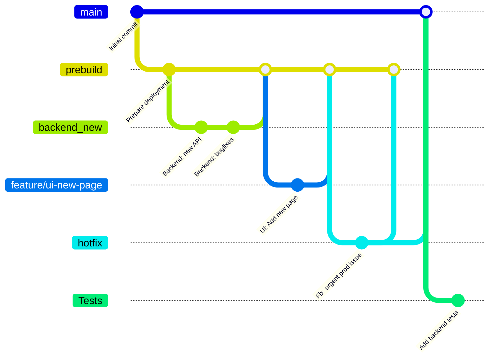

## Development

### Kanban board

Our team uses a Kanban board to manage tasks during the development process. You can view the board here:  
[🔗 Kanban Board Link](https://github.com/users/kite121/projects/1)

**Columns and Entry Criteria:**

- **To Do**  
  _Entry criteria_: The task was accepted by the team and has a description and a goal. The task also has a priority and a Story Points rating.

- **In Progress**  
  _Entry criteria_: The task is being completed in the current sprint. The task is assigned to a specific person and has Acceptance criteria for accepting the work.

- **Done**  
  _Entry criteria_: All acceptance criteria have been met. The task was accepted by the team and the customer.

---

### Git workflow

We adapted the **GitHub Flow** model with additional structure for code quality and collaboration.

#### 📌 Issue Management

- Issues are created with a detailed and accurate description of the task, including the necessary requirements.
- Each issue should be labeled depending on its type (UI, backend, ML, bug, optional).
- Each question must be evaluated together with the poker team, and then labeled 'estimated: x' (where x is the number of Story Points assigned during the poker game)
- The assignment is made only after the team discusses it during scrum planning, where the issues that have already been raised will be assigned during the sprint.
- Issues are created using [Issue Templates](https://github.com/Kazualov/endoscopy_tool/tree/485387f3265be78259112ad46ae5883865a9260e/.github/ISSUE_TEMPLATE) defined in the repository.

#### 🌿 Branching Strategy

Our project follows a **custom Gitflow-inspired workflow**, designed to maintain code stability, separate concerns, and streamline deployment.

##### 🌳 Main Branches
- **`main`**  
  Contains only **stable, production-ready** code.  
  Merges occur only after thorough testing and successful deployment.

- **`prebuild`**  
  Serves as a **staging area** for deployment.  
  Code from development branches is merged here for integration testing before going to `main`.

##### 🛠 Development Branches

- **`backend_new`**  
  All new backend features are developed here.  
  Once complete, changes are merged into `prebuild`.

- **`prebuild`**  
  Integration branch for UI development.  
  Frontend developers create separate branches from `prebuild` and merge them back upon feature completion.

- **`Tests`**  
  Contains all **automated tests** and related infrastructure.  
  Updated in parallel with feature development.

##### 🔥 Hotfixes

- **`hotfix/*`**  
  Used for **critical bug fixes** in production.  
  These branches are created from `main`, then merged back into both `main` and `prebuild`.

---

This strategy allows for:
- ✅ Isolated and parallel development of backend and UI
- 🚀 Smooth deployment pipeline from development to production
- 🧯 Quick integration of emergency fixes

#### ✅ Commits

- Custom structure is used for comets. It is necessary to specify the main changes written in English, and it would be good to specify the issue that was resolved or relates to it.

#### 🔀 Pull Requests

- Backend features are developed in the `backend_new` branch and merged into `prebuild` via PRs.
- UI and other feature branches (e.g., `feature/*`) are branched from and merged into `prebuild`.
- Bugfix branches (`bugfix/*`) are also merged into `prebuild`.
- Hotfix branches (`hotfix/*`) are created from `main` and merged back into both `main` and `prebuild`.
- All PRs (except hotfixes) target the `prebuild` branch.
- Hotfix PRs target the `main` branch directly.
- Each PR must use the [Pull Request Template](https://github.com/Kazualov/endoscopy_tool/blob/485387f3265be78259112ad46ae5883865a9260e/.github/pull-request-template.md) and link relevant issues with keywords like `Closes #issue_number`.

#### 🧪 Code Reviews

- At least one team member must review the code before big merging.
- Reviewers check for correctness, readability, test coverage, and adherence to style guidelines.

#### 🚀 Merging PRs

- Big PRs are merged only after all reviews and CI checks pass.
-If the merge is not large and the team member is completely confident that everything is fine, then a review is not necessary

#### 🧹 Resolving Issues

- Issues are closed automatically by referencing them in the merged PRs (e.g., `Closes #12`).

---

### 📈 Git Workflow Diagram

---

### Secrets management
- We do not have any data that requires encryption, so no methods have been used to encrypt or protect the data.
